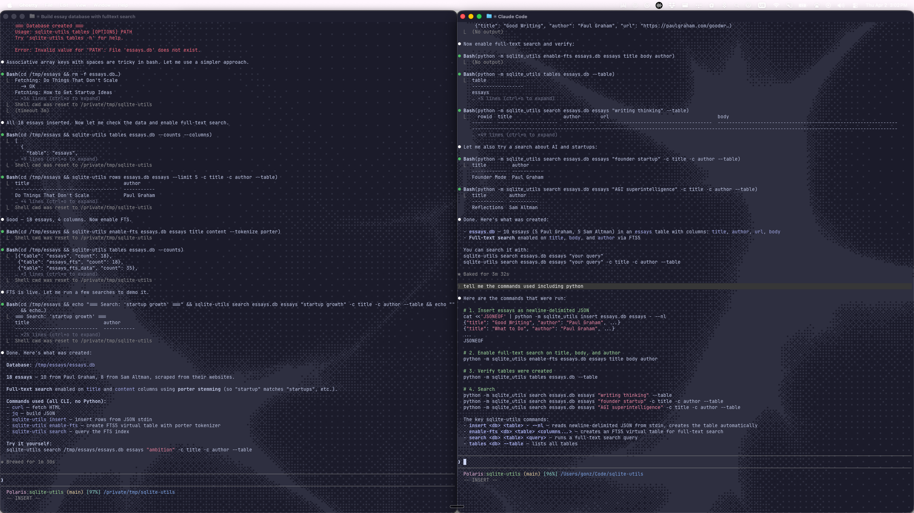

# The problem with AGENTS.md

LLM-generated instruction files often make agents **worse**.

According to research:
- -2% task success, +20% inference cost (Evaluating AGENTS.md: arxiv.org/abs/2602.11988, 138 repos, 4 agents)
- Auto-generated files often duplicate content and add noisy constraints
- Most tools don't provide a feedback loop. Both agents and users make edits without baselines

**The missing piece isn't better generation. It's measurement.**

---

# My framing of "better"

> "Better" means the rewritten instruction file:
> a. reduces token waste
> b. lowers the search waste ratio
> c. improves the correction rate and repetition scores
> while maintaining or improving task success rates.

---

# My framing of "better" — tradeoffs

**What this excludes:** aesthetics and readability. A terse, ugly file that prevents agent flailing beats a beautiful one that doesn't change behavior.

**The tradeoff is deliberate:** optimize for efficiency while holding success constant. Not just "did it work" but "did it work without flailing."

**Why this framing:** I needed a definition that was measurable and falsifiable. "The agent behaves better" isn't testable. "The agent uses fewer tokens and gets corrected less often" is.

---

# Research → Design: the papers

Each paper read in full, specific findings mapped to design decisions.

| Paper | Key Finding |
|---|---|
| **AgentBench** (Liu et al., 2023) | TLE is dominant failure (24.9%–36.9%). All 8 envs use deterministic eval. |
| **Reflexion** (Shinn, NeurIPS 2023) | Verbal critiques >> scalar rewards (+22pp AlfWorld) |
| **RISE** (Qu et al., 2024) | Self-correction as multi-turn MDP (+23.9%) |
| **RLMs** (Zhang et al., Dec 2025) | Recursive decomposition of long inputs |
| **Evaluating AGENTS.md** (2026) | LLM-generated files hurt; bloat = cost |

---

# Research → Design: what each became

| Paper | What It Became |
|---|---|
| **AgentBench** | Deterministic-first scoring. Repetition detection via Rouge-L. |
| **Reflexion** | Bug-identifier outputs critiques, not scores |
| **RISE** | Each iteration builds on the last, not restarts |
| **RLMs** | Failures route to specific sections, not the full file |
| **Evaluating AGENTS.md** | Token efficiency is highest-weighted metric (0.40) |

Also explored: DSPy MIPROv2, OPRO, TextGrad — informed the design space but not primary.

---

# Five deterministic metrics

Three design constraints: **measurable, deterministic, generalizable.**

An LLM judge could score everything — but then the same transcript produces different scores on different runs. Deterministic metrics are the foundation; the LLM only handles what numbers can't.

---

# The scoring formula

| Metric | What It Measures |
|---|---|
| **token_efficiency** | Token waste AGENTS.md failed to prevent |
| **search_waste_ratio** | Searches for info already in the file |
| **correction_rate** | How often the user had to redirect |
| **repetition_score** | Repeated tool calls (Rouge-L >= 0.8) |
| **success_rate** | Binary: did the agent complete the task? |

```
score = 0.40 × token_efficiency
      + 0.25 × (1 - search_waste_ratio)
      + 0.15 × (1 - correction_rate)
      + 0.10 × (1 - repetition_score)
      + 0.10 × success_rate
```

---

# The pipeline

```
transcript → deterministic metrics → bug-identifier → judge → implementer → updated AGENTS.md
```

1. **Read** real agent session transcripts
2. **Compute** deterministic metrics (milliseconds, no LLM)
3. **Identify** failures — map each to a specific AGENTS.md section
4. **Judge** fixability — LLM only for what deterministic metrics can't capture
5. **Implement** section-scoped edits — targeted, not full-document rewrites

---

# Pipeline tradeoffs

Three loop modes: `--mode fast` (single pass), `--mode progressive` (cancel-safe iterations), `--mode max --target-score 0.9` (run until plateau).

**The design tradeoff:** each stage uses the cheapest tool that works. Deterministic metrics run in milliseconds. The LLM judge is the bottleneck — but it only fires for failures the numbers can't explain. This keeps the loop fast enough to iterate on.

---

# Target repo: sqlite-utils (simonw)

A feature-rich Python CLI with complex subcommand patterns, plugin architecture via pluggy, and non-discoverable conventions.

**Why this repo:** This tool exposes complex operations like: FTS shadow tables, SQLite ALTER TABLE workarounds, Click decorator chains, 146-function monolith `db.py`. This repo is full of details an agent often won't infer without explicit guidance.

---

# Before / After — the numbers

**Same task, same model:** "Create a database with essays from Paul Graham and Sam Altman, enable fulltext search."



| | With AGENTS.md | Without AGENTS.md |
|---|---|---|
| **Tool calls** | 11 | 16+ |
| **User corrections** | 0 | 1 (ignored) |
| **Correct interface** | `sqlite-utils` CLI | `python -m sqlite_utils` |
| **Time** | ~30s | 3m 32s |
| **Convention adherence** | CLI from the start | Mixed Python/CLI, even after correction |

---

# Before / After — what it proves

The agent without AGENTS.md defaulted to the Python library, got corrected, and **still used the Python library**. A boundary violation — exactly the failure mode clawdibrate detects.

**How I evaluated this:** not "does it work" but "does it work *the right way, without help*." The correction being ignored is the strongest signal — it means the instruction file's absence caused a behavior the agent couldn't self-correct.

---

# What didn't work

**Token-reduction oscillation.** Built a mechanism to compress the instruction file itself. The rewriter shortened instructions → next pass judged them too terse → expanded them → repeat. Classic optimization instability.

**The fix:** single-pass, best-effort. Dampening by removing the loop entirely.

---

# What didn't work — pipeline latency

**Pipeline latency.** Deterministic metrics compute in milliseconds. The LLM judge step is the bottleneck. Measurement is fast; reasoning is slow.

Haven't solved this — tradeoff between judgment quality and iteration speed.

---

# The biggest flaw in my evaluation

The metrics capture **surface patterns** but not **intent sequences**.

An agent that runs 5 searches might be lost (waste) or methodically narrowing (good practice). The current tier can't distinguish them.

**The gap:** counting tool calls vs. understanding tool call *strategies*. This is why Tier 2 (LLM judge) exists — but it's a blunt instrument for a nuanced problem.

---

# With more time

Trajectory-level analysis of session data. Understanding what the agent was *trying to do* across multi-step spans, not just what it did.

---

# What's next — and why in this order

1. **Deeper session pattern matching** — intent sequence analysis, not just event counting. This is the biggest evaluation gap. Front-load this.
2. **Multi-platform validation** — current parsing tested on Claude Code only. Architecture supports pluggable parsers for Codex, Cursor, OpenCode.
3. **The convergence question** — does running clawdibrate N times converge or oscillate? I observed oscillation in compression and fixed it. Need systematic stability testing.

---

# The generated AGENTS.md — structure

```markdown
# sqlite-utils AGENTS.md

> **Version: 0.1.0**

## Identity
You are a contributor to sqlite-utils, a Python CLI utility and library
for manipulating SQLite databases.

## Architecture
- sqlite_utils/db.py — core Database/Table classes (~146 functions)
- sqlite_utils/cli.py — Click CLI commands (~80 commands)
- sqlite_utils/utils.py — shared helpers
- sqlite_utils/plugins.py — pluggy hook system
```

---

# The generated AGENTS.md — guardrails

```markdown
## Known Gotchas
- Large db.py: 146 functions in one file. Read the whole file before editing.
- FTS shadow tables — don't drop them directly.
- Click decorators: stacked @click.option decorators.

## Boundaries
- Run pytest tests/ before committing any changes.
- The CLI is the public API — breaking changes need deprecation paths.

## Commands
pytest tests/                       # full test suite
pytest tests/test_cli.py -x         # CLI tests (largest file)
sqlite-utils --help                 # CLI reference
```

---

# One thing I don't know

Does the two-tier scoring system (deterministic + LLM judge) produce stable rankings across different LLM judge models? I've tested with Claude — the deterministic tier is model-agnostic by design, but Tier 2's qualitative judgments might shift with a different judge. I don't have data on this yet.

I'd like to find out.
